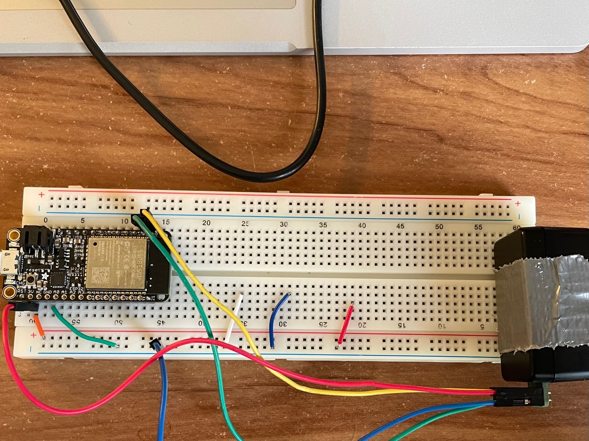

#  Garmin V4 Lidar

Author: Andrew Brownback

Date: 2022-04-19
-----

## Summary

I wired the lidar using the specifications sheet for the Garmin V4 LED lidar which uses 5 volts of power. The sensor uses the I2C from the ESP to send and receive its data and outputs the measured distance in centimeters which I display on the console. The previous code for the ADXL accelerometer was a big help in determining how to code for this lidar. 

## Sketches and Photos
### Wiring

- [Link to video demo! ==>](https://drive.google.com/file/d/1oMpEqmCUMGvd4mJ5XvuvR0u_Xt-aoJWY/view?usp=sharing).

- [Link to my Code! ==>](https://github.com/BU-EC444/Brownback-Andrew/tree/master/skills/cluster-5/31/code).

## Modules, Tools, Source Used Including Attribution

The below links helped in my design including converting arduino code to C for the ESP. 

## Supporting Artifacts

http://static.garmin.com/pumac/LIDAR-Lite%20LED%20v4%20Instructions_EN-US.pdf

https://github.com/garmin/LIDARLite_Arduino_Library

https://github.com/espressif/esp-idf/tree/master/examples/peripherals/i2c/i2c_simple

-----
