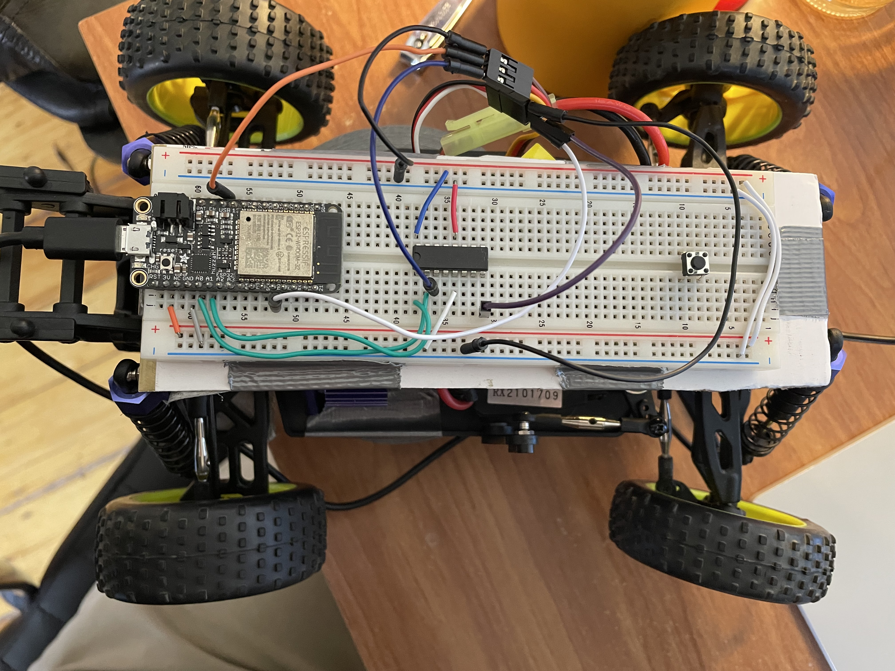

#  Crawler

Author: Team 11, Andrew Brownback, Mark Vinciguerra, Timin Kanani

Date: 2022-04-15
-----

## Summary

In this skill we wired up the ESP to our buggy using the Buggy's ESC and an H-bridge to handle the signals. The ESC outputs 5 volts which we used as input to our H-bridge and also to give 5V input to the steering servo. The signal which controls the steering servo is output from the H-bridge so that the correct amplified frequency is inputed to the servo motor for steering. The servo which controls the motor speed could be take a signal directly from the esp which is what we did. We then wrote a program which callibrates the ESC, shows that driving forward works. Then switches to reverse mode and shows that reverse works as well. Each time also showing that stopping works too. Then the steering servo is put to work, which shows that the wheels turn left and right the way we want them to.  

## Sketches and Photos
### Wiring Photo

- [Link to video demo! ==>](https://drive.google.com/file/d/1V9ffcQubx8Z4S7P2zYGD-UZ0r2O43Or2/view?usp=sharing).

- [Link to our Code! ==>](https://github.com/BU-EC444/Brownback-Andrew/tree/master/skills/cluster-5/30/code).

## Modules, Tools, Source Used Including Attribution

We used the below links to guide our design

## Supporting Artifacts

https://github.com/BU-EC444/bu-ec444-whizzer/blob/Spring-2022/briefs/design-patterns/dp-esc-buggy.md

https://www.hobbywing.com/products/enpdf/QuicRunWP1625-WP860-WP1060.pdf

https://p11.secure.hostingprod.com/@hobbypartz.com/ssl/ibuyrc/manual/51C852.pdf

-----
