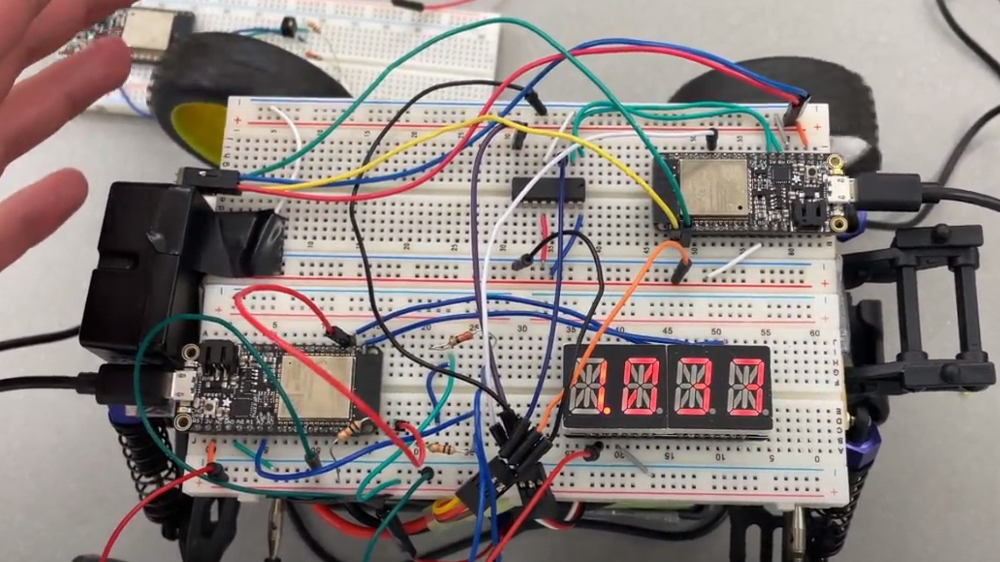
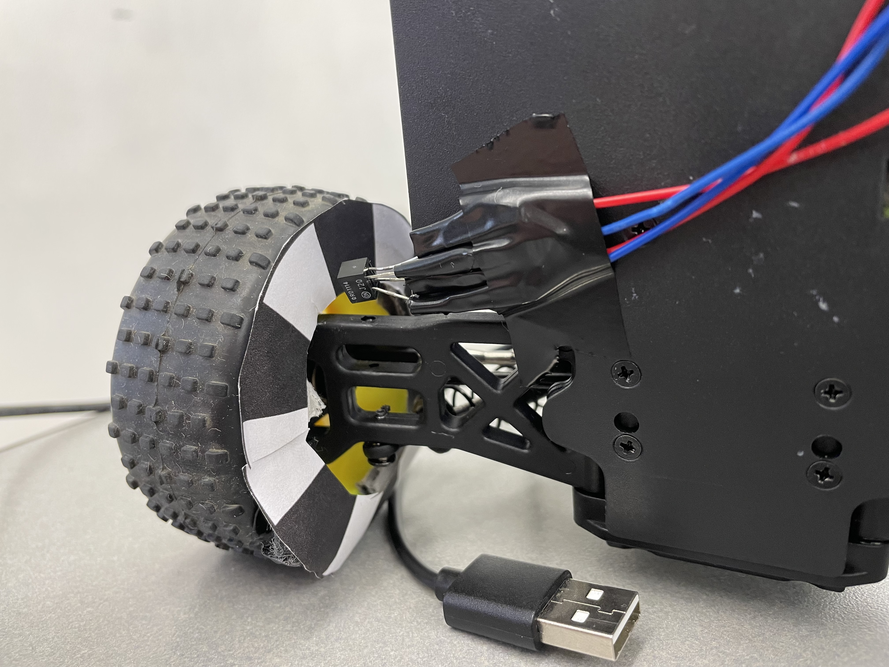

#  Optical Encoder for Speed Sensor

Author: Andrew Brownback

Date: 2022-04-22
-----

## Summary

This code uses the i2c display and an optical encoder to count the pulses of a black and white pattern fixed to the wheel of our buggy and outputs the speed and pulse count each time the color switches from black to white both on terminal and the i2c display. Using a wheel speed encoder template to demonstrate the changing colors from black to white, the optical encoder can then output to ADC a pulse in voltage which is then detected by the pulse counter code we wrote. 

## Sketches and Photos

### Wiring

### Sensor

- [Link to video demo! ==>](https://drive.google.com/file/d/1W1bHLQvz5nY5Ga4VFWq3KZCgxmWCzKjq/view?usp=sharing).

- [Link to my Code! ==>](https://github.com/BU-EC444/Brownback-Andrew/tree/master/skills/cluster-5/32/code).

## Modules, Tools, Source Used Including Attribution

The below links were helpful in our design

## Supporting Artifacts

https://learn.sparkfun.com/tutorials/qrd1114-optical-detector-hookup-guide#example-circuit

https://docs.espressif.com/projects/esp-idf/en/latest/esp32/api-reference/peripherals/pcnt.html

https://docs.espressif.com/projects/esp-idf/en/latest/esp32/api-reference/peripherals/gptimer.html

https://github.com/BU-EC444/bu-ec444-whizzer/blob/Spring-2022/images/encoder.gif

-----
