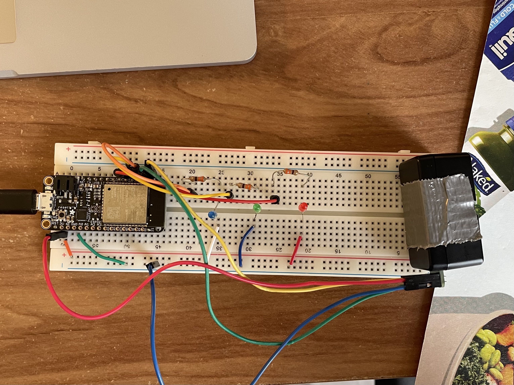
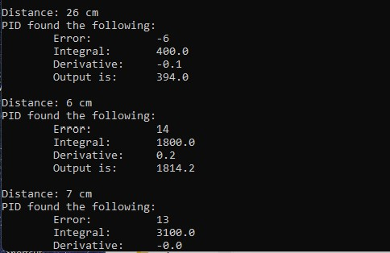

#  Proportional, Integral, Differential (PID)

Author: Andrew Brownback

Date: 2022-04-20
-----

## Summary

In implementing the PID algorithm we used the error to control the state of the LEDs based on the distance from the LIDAR. Using a setpoint of 20cm, and an error tolerance of 1. Meaning that if the object was too close, meaning error < -1, the red LED, would light up. If it measured within 1 of 20cm, meaning -1 < error < 1, then the green LED would light up, and if error > 1 meaning it was too far the blue LED would light up as shown in the video. I also dispay the derivative and integral in terminal which measure how quickly the error happens and steady state error respectively. 

## Sketches and Photos
### Wiring

### Terminal Output

- [Link to video demo! ==>](https://drive.google.com/file/d/1dIq9OkglSTjUsSaEQPm_99v8UIj-8SHp/view?usp=sharing).

- [Link to my Code! ==>](https://github.com/BU-EC444/Brownback-Andrew/tree/master/skills/cluster-5/33/code).

## Modules, Tools, Source Used Including Attribution

I used the below link to help design the PID algorithm 

## Supporting Artifacts

https://github.com/BU-EC444/bu-ec444-whizzer/blob/Spring-2022/briefs/design-patterns/dp-pid.md

-----
